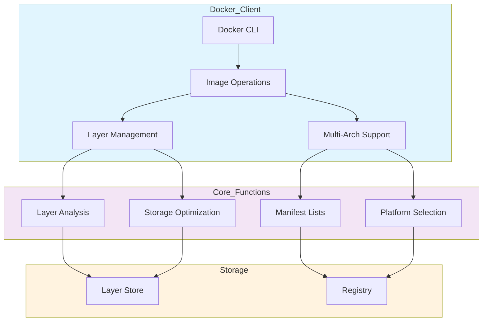

# 🐳 Docker Image Layer Architecture & Multi-Platform Deployment

[](https://github.com/TheToriqul/docker-image-layers)
[](https://github.com/TheToriqul/docker-image-layers/stargazers)


## 📋 Project Overview

This project demonstrates advanced Docker image layer management and multi-architecture deployment strategies. Through hands-on implementation, I explore Docker's sophisticated layer sharing mechanisms, digest-based image management, and cross-platform compatibility features. The project serves as both a learning journey and a practical reference for enterprise-grade Docker deployments.

## 🎯 Key Objectives

- Master Docker's layer architecture and optimization techniques
- Implement secure, digest-based image management workflows
- Configure and manage multi-architecture image deployments
- Optimize storage through intelligent layer sharing
- Create production-ready Docker deployment patterns

## 🏗️ Project Architecture



## 💻 Technical Stack

- Docker Engine: Container runtime and image management
- Linux: Base operating system for container operations
- Shell Scripting: Automation and tooling
- Docker Registry: Image storage and distribution
- Docker Manifest: Multi-architecture support

## 🚀 Getting Started

<details>
<summary>🐳 Prerequisites</summary>

- Docker Engine 20.10.x or higher
- Linux-based operating system
- Basic understanding of containerization
- Git for version control
- Shell scripting knowledge

</details>

<details>
<summary>⚙️ Installation</summary>

1. Clone the repository:
   ```bash
   git clone https://github.com/TheToriqul/docker-image-layers.git
   ```
2. Navigate to the project directory:
   ```bash
   cd docker-image-layers
   ```

</details>

<details>
<summary>🎮 Usage</summary>

1. Explore layer sharing:
   ```bash
   docker history ubuntu:latest
   ```
2. Analyze storage optimization:
   ```bash
   docker system df -v
   ```
3. Inspect multi-architecture support:
   ```bash
   docker manifest inspect golang
   ```

For detailed commands and explanations, refer to the [reference-commands.md](reference-commands.md) file.

</details>

## 💡 Key Learnings

### Technical Mastery:

1. Docker layer architecture and caching mechanisms
2. Content-addressable storage implementation
3. Cross-platform container deployment strategies
4. Layer sharing optimization techniques
5. Manifest list management and manipulation

### Professional Development:

1. Enterprise-grade container management
2. System architecture optimization
3. Technical documentation creation
4. Cross-platform compatibility handling
5. Security best practices implementation

### 🔄 Future Enhancements

<details>
<summary>View Planned Improvements</summary>

1. Automated layer analysis toolkit
2. Custom manifest manipulation tools
3. Storage optimization metrics dashboard
4. Layer relationship visualization
5. Multi-architecture testing framework
6. CI/CD integration examples
</details>

## 🙌 Contribution

Contributions are welcome! Feel free to [open an issue](https://github.com/TheToriqul/docker-image-layers/issues) or submit a [pull request](https://github.com/TheToriqul/docker-image-layers/pulls) to suggest improvements or add features.

## 📧 Connect with Me

- 📧 Email: toriqul.int@gmail.com
- 📱 Phone: +65 8936 7705, +8801765 939006
- 🌐 LinkedIn: [@TheToriqul](https://www.linkedin.com/in/thetoriqul/)
- 🐙 GitHub: [@TheToriqul](https://github.com/TheToriqul)
- 🌍 Portfolio: [TheToriqul.com](https://thetoriqul.com)

Let's connect and discuss Docker optimization strategies!

## 👏 Acknowledgments

- [Docker Documentation](https://docs.docker.com/) for comprehensive reference material
- [Poridhi](https://poridhi.io/) for providing comprehensive labs and inspiring this project
- The Docker community for sharing insights and best practices

---

Thank you for exploring this Docker Image Layer Architecture project. I hope you find these insights and implementations valuable for your container optimization journey! 🚀